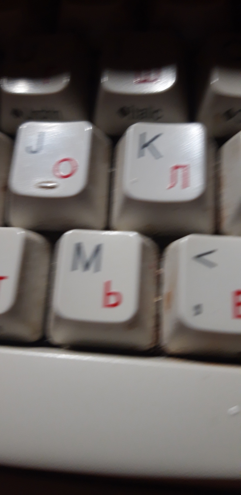

## 🌀 Image Deblurring with TensorFlow and OpenCV

This project implements a simple image deblurring pipeline using a convolutional autoencoder built with TensorFlow and Keras. It loads blurred and sharp image pairs for training, builds and trains a deep learning model, and then applies the model to deblur new images.

---

### 📂 Project Structure

```
.
├── blurry/                # Folder containing blurred training images
├── unblurry/              # Folder containing sharp (ground truth) images
├── Blurry_Image.jpg       # Image to test the trained model on
├── Deblurred_Image.jpg    # Output image after deblurring
├── deblur_model.h5        # Saved Keras model (auto-saved after training)
├── main.py                # Python file with all functions and pipeline
└── README.md              # This file
```

---

### 🚀 Features

* Loads and preprocesses image datasets
* Crops or pads images to a fixed size (default: 500x500)
* Builds a simple encoder-decoder (autoencoder) neural network
* Trains the network using mean squared error
* Saves and loads models for reuse
* Performs inference to deblur new images

---

### 🔧 Requirements

* Python 3.7+
* TensorFlow 2.x
* OpenCV
* NumPy
* Pillow
* Matplotlib

Install dependencies:

```bash
pip install tensorflow opencv-python numpy pillow matplotlib
```

---

### ▶️ How to Use

1. **Prepare Data**:

   * Place blurred images in the `./blurry/` folder.
   * Place the corresponding sharp images in the `./unblurry/` folder.

2. **Add a test image**:

   * Put your test image as `Blurry_Image.jpg` in the root directory.

3. **Run the code**:

   ```bash
   python main.py
   ```

   * If `deblur_model.h5` exists, it loads the model.
   * If not, it trains a model using the data in `blurry/` and `unblurry/`.

4. **Output**:

   * The deblurred result will be shown and saved as `Deblurred_Image.jpg`.

---

### 📌 Notes

* Image dimensions are standardized to 500x500 by default. You can change this in the `target_size` parameter.
* The model is minimal and designed for educational purposes. For higher-quality results, consider deeper networks or pretrained architectures.
* Make sure the number of images and order in the `blurry/` and `unblurry/` folders match.

---

### 📷 Example

| Blurred Input                 | Deblurred Output                    |
| ----------------------------- | ----------------------------------- |
|  |  |

---

### 📬 Contact

For questions or improvements, feel free to open an issue or fork the repo!


